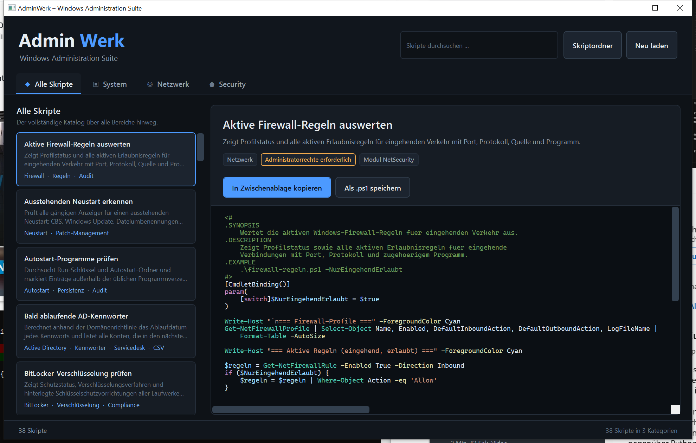

<p align="center">
  <picture>
    <source media="(prefers-color-scheme: dark)" srcset="docs/bilder/logo-wortmarke-dunkel.png">
    
  </picture>
</p>

<p align="center">
  <a href="https://github.com/alikiratli/AdminWerk/actions/workflows/pruefung.yml">
    
  </a>
</p>

Eine WPF-Anwendung, die geprüfte PowerShell-Skripte für die tägliche Windows-Administration
bereitstellt. Kategorisiert, durchsuchbar, mit Syntaxhervorhebung — und mit einem Klick in der
Zwischenablage oder als `.ps1`-Datei gespeichert.



---

## Warum AdminWerk?

Wer Windows-Systeme betreut, schreibt dieselben Skripte immer wieder: Speicherplatz prüfen,
Dienste überwachen, den Patchstand ermitteln, ein Sicherheits-Audit fahren. AdminWerk sammelt
diese Skripte an einem Ort — sauber dokumentiert, mit Hinweisen zu benötigten Rechten und
Modulen, sofort einsatzbereit.

**Die Anwendung führt keine Skripte aus.** Sie stellt sie zur Verfügung; ausgeführt werden sie
bewusst von Hand in einer PowerShell-Sitzung, in der die Administratorin oder der Administrator
den Inhalt vorher gelesen hat.

---

## Funktionen

| Funktion | Beschreibung |
|---|---|
| **Kategorien** | System, Netzwerk, Konten und Security als eigene Bereiche, dazu eine Gesamtansicht |
| **Favoriten** | Häufig gebrauchte Skripte mit dem Stern markieren (oder `Strg+D`) und über den eigenen Reiter „Favoriten“ wiederfinden |
| **Volltextsuche** | Durchsucht Titel, Beschreibung, Schlagwörter **und** den Skriptinhalt |
| **Syntaxhervorhebung** | PowerShell-Quelltext farblich aufbereitet (Kommentare, Cmdlets, Variablen, Parameter) |
| **Zwischenablage** | Das vollständige Skript mit einem Klick kopieren |
| **Als `.ps1` speichern** | Export mit UTF-8-BOM, damit Windows PowerShell 5.1 die Umlaute korrekt liest |
| **Kennzeichnung** | Jedes Skript zeigt Kategorie, benötigte Rechte und Voraussetzungen |
| **Erweiterbar** | Eigene Skripte im Ordner `Scripts` ergänzen, `catalog.json` pflegen, „Neu laden“ klicken |

Die Favoritenauswahl liegt je Benutzer unter `%AppData%\AdminWerk\favoriten.json` und überlebt
sowohl einen Neustart der Anwendung als auch eine Erweiterung des Skriptkatalogs.

---

## Skriptkatalog

Aktuell **51 Skripte** in vier Bereichen.

### ▣ System (16)

| Skript | Zweck |
|---|---|
| Freien Speicherplatz prüfen | Schwellenwertprüfung aller Datenträger mit Protokollierung |
| HTML-Bericht zur Datenträgerbelegung | Farbig aufbereiteter Bericht über mehrere Computer |
| Systemdateien prüfen und reparieren | DISM und SFC in der empfohlenen Reihenfolge |
| Letzter Neustart und Betriebsdauer | Uptime mit Neustartempfehlung |
| Ausstehenden Neustart erkennen | CBS, Windows Update, Dateiumbenennungen, Computerumbenennung |
| Kritische Ereignisse im Ereignisprotokoll | Gruppiert nach Quelle und Ereignis-ID |
| Kritische Dienste überwachen und starten | Automatischer Neustart gestoppter Dienste mit Protokoll |
| Starttypen der Dienste gegen Soll prüfen | Deckt Abweichungen auf, die erst beim Neustart auffallen |
| **Dienststatus über mehrere Computer** | Matrix: eine Zeile je Computer, eine Spalte je Dienst |
| Patchstand und ausstehende Updates | Hotfix-Historie plus Windows-Update-Abfrage |
| **Patch-Compliance-Bericht** | Einstufung je System und Gesamtquote über den ganzen Bestand |
| Software-Inventar erstellen | Aus der Registrierung statt über `Win32_Product` |
| **Software-Inventar über mehrere Computer** | Verteilung je Version, uneinheitliche Stände, gezielte Suche |
| Hardware-Inventar erfassen | Seriennummer, Modell, CPU, RAM, BIOS, Netzwerk |
| Geplante Aufgaben prüfen | Fehlgeschlagene, deaktivierte und privilegierte Aufgaben |
| Prozesse mit höchster CPU- und RAM-Last | Echte CPU-Messung über zwei Messpunkte |

### ◎ Netzwerk (11)

| Skript | Zweck |
|---|---|
| Netzwerkdiagnose in einem Durchlauf | Adapter → IP → Gateway → DNS → Auflösung → Internet |
| Netzwerkadapter und IP-Konfiguration | Adapter, IP, Gateway, DNS und Treiber je Schnittstelle |
| TCP-Ports auf Erreichbarkeit testen | Ziel-/Port-Matrix mit Zeitlimit und Dienstnamen |
| Namensauflösung gegen mehrere DNS-Server | Findet abweichende Antworten zwischen Servern |
| Windows-DNS-Server prüfen | Dienst, Zonen, Weiterleitungen, Stichprobe |
| **DNS-Einträge einer Zone prüfen** | Alle Einträge nach Typ, DC-SRV-Einträge, veraltete A-Einträge |
| DHCP-Bereiche und Auslastung | Belegung in Prozent, abgelaufene Leases |
| Lauschende Ports mit Prozesszuordnung | Welches Programm hat welchen Port geöffnet |
| Route verfolgen und Latenz messen | Hebt den Sprung mit dem größten Latenzzuwachs hervor |
| Aktive Firewall-Regeln auswerten | Eingehende Erlaubnisregeln mit Port, Quelle und Programm |
| SMB-Freigaben und Berechtigungen | Freigabe- und NTFS-Rechte plus aktive Sitzungen |

### ◍ Konten (11)

Benutzer, Gruppen und Active Directory. Die vier Skripte, die etwas **verändern**, laufen
standardmäßig als Testlauf und tun erst mit `-Anwenden` etwas.

| Skript | Zweck |
|---|---|
| **Lokale Benutzer anlegen** | Einzeln oder als Stapel aus CSV, mit erzeugtem Kennwort |
| **Konten aktivieren oder deaktivieren** | Offboarding: sperren, aus Gruppen nehmen, Vermerk, OU-Umzug |
| **Lokale Gruppen und Mitglieder** | Zwei Sichten: je Gruppe und je Konto |
| **Lokale Konten und Aufräumkandidaten** | Nie angemeldet, inaktiv, Kennwort ohne Ablauf, ohne Kennwortpflicht |
| Lokale Administratoren auflisten | Über die SID — sprachunabhängig |
| **AD-Benutzer aus CSV anlegen** | Onboarding im Stapel mit Stammdaten, Vorgesetztem und Gruppen |
| **AD-Gruppenmitgliedschaften prüfen** | Wer ist drin, wo ist er drin, welche Gruppen sind leer oder riesig |
| **AD-Computer und Betriebssysteme** | Verteilung, Build-Stände, Systeme ohne Herstellerunterstützung |
| **AD: Deaktivierte und abgelaufene Konten** | Inklusive deaktivierter Konten in privilegierten Gruppen |
| Inaktive AD-Konten finden | Benutzer und Computer ohne Anmeldung seit X Tagen |
| Bald ablaufende AD-Kennwörter | Mit Vorlaufzeit und CSV-Export für den Servicedesk |

### ⬟ Security (13)

| Skript | Zweck |
|---|---|
| **Vollständige Sicherheitsprüfung mit Bewertung** | Alle Kernprüfungen in einem Lauf, Punktzahl 0–10 |
| Microsoft Defender — Status und Ausschlüsse | Echtzeitschutz, Signaturen, Manipulationsschutz, Ausschlüsse |
| Firewall-Profile und Standardverhalten | Alle drei Profile inklusive Protokollierung |
| BitLocker-Verschlüsselung prüfen | Schutzstatus und Schlüsselschutzvorrichtungen |
| Gast- und Standardkonten prüfen | Konten mit SID-Endung `-500` und `-501` |
| RDP-Konfiguration prüfen | Port, NLA, Sicherheitsstufe, Berechtigte, Firewall |
| **RDP-Sitzungsverlauf auswerten** | Verbindungen mit Quell-IP, Zeiten, fehlgeschlagene RDP-Logins |
| Fehlgeschlagene Anmeldungen auswerten | Erkennt Brute Force und Password Spraying |
| Letzte erfolgreiche Anmeldungen | Ohne das Rauschen der Dienstanmeldungen |
| Autostart-Programme prüfen | Markiert Einträge außerhalb üblicher Programmverzeichnisse |
| Verdächtige Dienste aufspüren | Ungequotete Pfade, fehlende Signaturen |
| Kennwort- und Sperrrichtlinie prüfen | Lokal und in der Domäne, mit Bewertung |
| Privilegierte AD-Gruppen prüfen | Domänen-, Organisations-, Schema-Admins, rekursiv |

---

## Installation

### Voraussetzungen

* Windows 10 / 11 oder Windows Server 2016 und neuer
* [.NET 8 Desktop Runtime](https://dotnet.microsoft.com/download/dotnet/8.0) (zum Ausführen)
* [.NET 8 SDK](https://dotnet.microsoft.com/download/dotnet/8.0) oder neuer (zum Bauen)

### Bauen und starten

```powershell
git clone https://github.com/alikiratli/AdminWerk.git
cd AdminWerk
dotnet build
dotnet run --project src\AdminWerk
```

### Eigenständige Datei erzeugen

```powershell
dotnet publish src\AdminWerk -c Release -r win-x64 --self-contained false -o veroeffentlichung
```

---

## Eigene Skripte ergänzen

1. Die `.ps1`-Datei unter `src/AdminWerk/Scripts/<kategorie>/` ablegen.
2. In `src/AdminWerk/Scripts/catalog.json` einen Eintrag ergänzen:

```json
{
  "id": "sys-mein-skript",
  "kategorie": "system",
  "titel": "Mein Skript",
  "beschreibung": "Was das Skript tut.",
  "datei": "system/mein-skript.ps1",
  "tags": ["Beispiel"],
  "adminRechte": true,
  "voraussetzung": "Windows 10/11"
}
```

3. In der Anwendung auf **Neu laden** klicken — ein Neustart ist nicht nötig.

Die Schaltfläche **Skriptordner** öffnet das Verzeichnis direkt im Explorer.

---

## Prüfung

Jeder Push und jeder Pull Request auf `main` läuft durch zwei Aufträge
(`.github/workflows/pruefung.yml`):

| Auftrag | Was geprüft wird |
|---|---|
| **Anwendung bauen** | `dotnet build` in `Release`, Warnungen gelten als Fehler |
| **Skriptkatalog prüfen** | Syntax, Katalogabgleich, Pflichtangaben, PSScriptAnalyzer |

Beides lässt sich vor dem Commit lokal ausführen:

```powershell
# Syntax, Katalogabgleich und Pflichtangaben
.	ools\katalog-pruefen.ps1

# Stilregeln
Invoke-ScriptAnalyzer -Path .\src\AdminWerk\Scripts -Recurse `
    -Settings .	ools\PSScriptAnalyzerSettings.psd1
```

`katalog-pruefen.ps1` prüft in einem Durchlauf:

1. **Syntax** — jede `.ps1` wird mit dem PowerShell-Parser eingelesen.
2. **5.1-Tauglichkeit** — der Parser allein reicht dafür nicht. `(if … )` als Argument
   übersteht ihn anstandslos und scheitert erst zur Laufzeit mit *„if wurde nicht als Name
   eines Cmdlet erkannt"*. Eine zusätzliche Prüfung über den Syntaxbaum sucht deshalb nach
   Schlüsselwörtern, die als Befehl statt als Ausdruck stehen.
3. **Abgleich** — jeder Katalogeintrag zeigt auf eine vorhandene Datei, und jede Datei ist
   im Katalog verzeichnet.
4. **Pflichtangaben** — Felder gefüllt, Bezeichner eindeutig, Kategorie bekannt,
   `.SYNOPSIS` vorhanden.

Der CI-Schritt läuft bewusst unter **Windows PowerShell 5.1**, nicht unter `pwsh` — nur
dieser Parser ist der Maßstab, auf den der Katalog zielt. Die Ausnahmen für
PSScriptAnalyzer stehen mit Begründung in `tools/PSScriptAnalyzerSettings.psd1`.

---

## Projektaufbau

```
AdminWerk/
├── AdminWerk.sln
├── README.md
├── docs/
│   ├── FORTSCHRITT.md          Entwicklungstagebuch
│   └── bilder/                 Bildmarke und Bildschirmfotos
├── .github/workflows/
│   └── pruefung.yml            CI: Build und Katalogprüfung
├── tools/
│   ├── logo-erzeugen.py        erzeugt Bildmarke, Wortmarke und .ico
│   ├── katalog-pruefen.ps1     Syntax, Abgleich, Pflichtangaben
│   └── PSScriptAnalyzerSettings.psd1
└── src/AdminWerk/
    ├── AdminWerk.csproj
    ├── App.xaml(.cs)           Anwendungseinstieg, deutsche Kultur
    ├── MainWindow.xaml(.cs)    Hauptfenster
    ├── Models/                 ScriptEintrag, ScriptKategorie, ScriptKatalog
    ├── Services/               KatalogDienst (catalog.json + .ps1), FavoritenDienst
    ├── ViewModels/             HauptViewModel, AktionsBefehl, ViewModelBasis
    ├── Views/                  PowerShellHervorhebung — Syntaxeinfärbung
    ├── Themes/                 Palette.xaml, Steuerelemente.xaml
    └── Scripts/
        ├── catalog.json
        ├── system/
        ├── netzwerk/
        ├── konten/
        └── security/
```

Die Anwendung ist nach MVVM aufgebaut und kommt ohne Fremdbibliotheken aus.

---

## Hinweise zum Einsatz

* **Skripte vor der Ausführung lesen.** Jedes Skript hat einen Kommentarkopf mit `.SYNOPSIS`,
  `.DESCRIPTION` und `.EXAMPLE`.
* **Erst prüfen, dann ändern.** Die meisten Skripte lesen nur. Die wenigen, die etwas
  verändern — Konten anlegen, sperren, Dienste starten —, laufen standardmäßig als Testlauf
  und zeigen zunächst nur, was sie tun *würden*. Erst `-Anwenden` (bzw. das Weglassen von
  `-NurPruefen`) führt die Änderung wirklich aus.
* **Eingebaute Konten bleiben unangetastet.** Die Konten-Skripte fassen Administrator (`-500`)
  und Gast (`-501`) grundsätzlich nicht an, auch nicht mit `-Anwenden`.
* **Erzeugte Kennwörter werden nur einmal angezeigt** und in keine Protokolldatei geschrieben.
* **Administratorrechte.** Die Kennzeichnung im Detailbereich weist aus, ob eine erhöhte
  PowerShell-Sitzung nötig ist.
* **Alle Skripte sind gegen den Parser von Windows PowerShell 5.1 geprüft** und kommen ohne
  Syntax aus, die erst ab PowerShell 7 verfügbar ist.

---

## Bildmarke

Ein Sechskant im Blauverlauf der Anwendung, darin ein „A“ — der Sechskant für „Werk“,
das A für AdminWerk. Bewusst ohne fremde Marken und ohne Anlehnung an bestehende Symbole:

* **kein Windows-Logo** — das ist eine Marke der Microsoft Corporation und in einem
  Produktsymbol Dritter nicht zulässig
* **keine blaue Kachel mit `>_`** — das ist praktisch das Symbol von PowerShell und wäre in
  der Taskleiste direkt daneben nicht zu unterscheiden

Alle Dateien entstehen aus `tools/logo-erzeugen.py`:

```powershell
python tools\logo-erzeugen.py .
```

| Datei | Zweck |
|---|---|
| `docs/bilder/logo.png` | Bildmarke, 512 px, transparent |
| `docs/bilder/logo-wortmarke-hell.png` | Wortmarke für helle Hintergründe |
| `docs/bilder/logo-wortmarke-dunkel.png` | Wortmarke für dunkle Hintergründe |
| `src/AdminWerk/Themes/adminwerk.ico` | Anwendungssymbol, 16 bis 256 px |

Bei kleinen Größen werden Rand und Buchstabengröße nachgeführt, damit die Marke auch bei
16 px in der Titelleiste lesbar bleibt.

---

## Lizenz

MIT — siehe [LICENSE](LICENSE).
